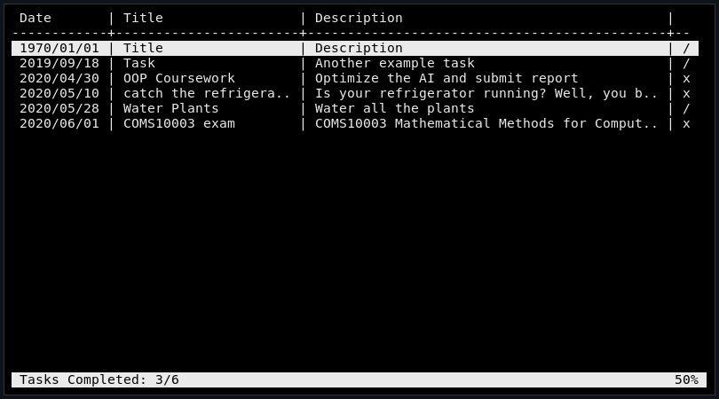
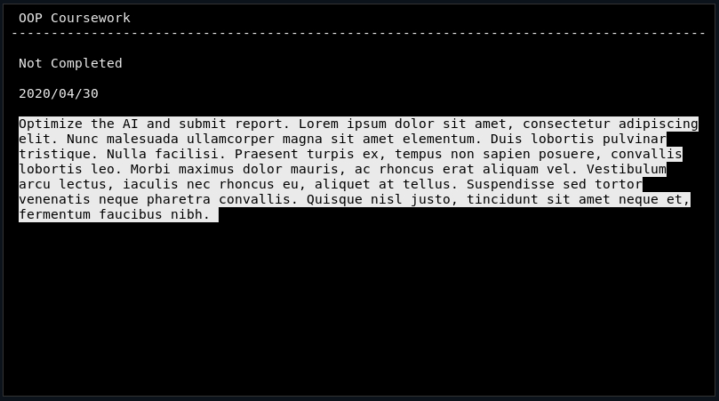

# todo
This is a simple tui task management tool




### Keybindings
(They are a bit insane)
###### Task List Mode
* J - Down
* K - UP
* O - Open Task
* A - Add Task
* D - Delete Task
* Q - Quit

###### Opened Task Mode
* J - Down
* K - UP
* I - Enter Edit Mode (ESC to exit)
* N - Next section of date
* P - Previous section of date
* W - Increment date section
* S - Decrement date section
* Q - Quit back to task list

### Build instructions
````
git clone https://github.com/rpinder/todo
cd todo
make && sudo make install
````
